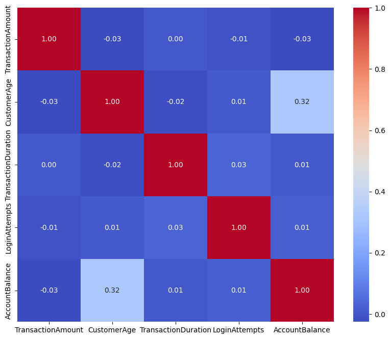
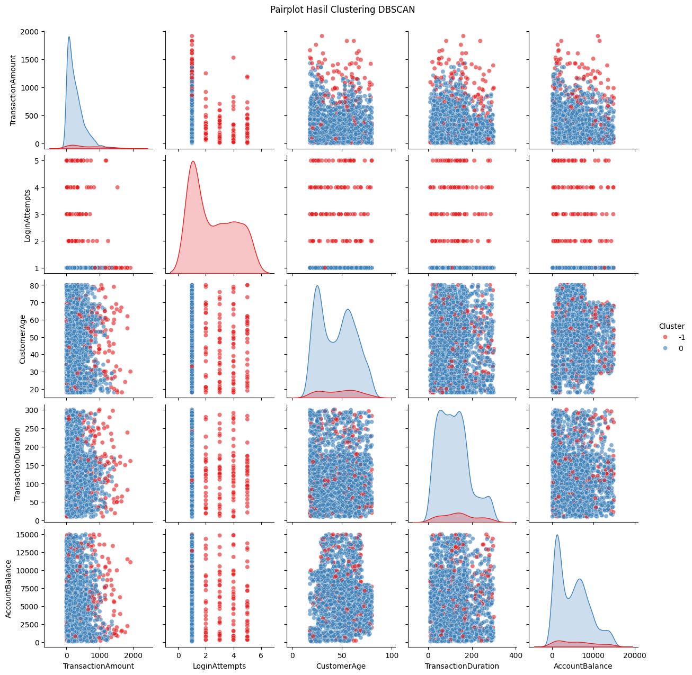

# Deteksi Fraud Menggunakan PCA dan DBSCAN

## Tentang Proyek

Proyek ini menganalisis data transaksi untuk mengidentifikasi pola yang tidak biasa dan potensi transaksi fraud. Analisis menggunakan **Principal Component Analysis (PCA)** untuk reduksi dimensi dan **DBSCAN (Density-Based Spatial Clustering of Applications with Noise)** untuk melakukan clustering serta mendeteksi outlier.

Proyek mencakup tahapan **preprocessing data, pemilihan fitur, reduksi dimensi, clustering, dan deteksi outlier** menggunakan Python.

## Hasil Utama

* Memilih **CustomerAge** dan **AccountBalance** sebagai fitur utama untuk proses clustering.
* Mengoptimalkan parameter DBSCAN dengan **ε (eps) = 0.14** dan **MinPts = 4**.
* Mengidentifikasi **2 cluster**, termasuk cluster yang dikategorikan sebagai outlier/noise.
* Memperoleh **Silhouette Score sebesar 0.7547**, yang menunjukkan hasil clustering yang cukup baik.

## Visualisasi

### Korelasi Antar Fitur

### Hasil Clustering DBSCAN

## Tools & Metode

* **Python**
* **Pandas**
* **NumPy**
* **Scikit-learn**
* **Matplotlib**
* **PCA**
* **DBSCAN**
* Preprocessing data
* Pemilihan fitur
* Clustering
* Deteksi outlier
